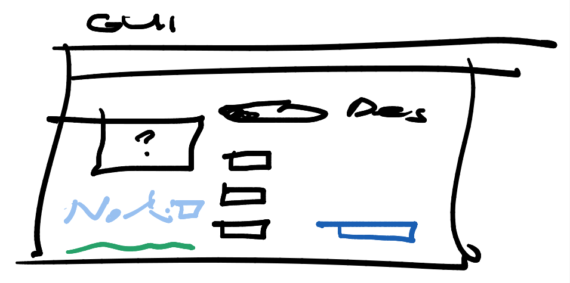

## Here we explain scenarios of different users

# Scenario 1: Alice

Alice is an MSc. student and is a first-time user. She has just heard of the software through a mention of the TWAIN project from colleagues. She clones the Github repository, opens Jupyter Notebook, and does the following:

1. She opens the file `exampleYawSetpoints.py,` which looks as follows:
```
import twain.moct as moct

moct.open(load='date/examples/wf20_12MW_homogeneous')
```
2. This opens a GUI, which looks like this:

3. In the example script, the layout for a 20-turbine wind turbine is already provided, which is visualized in the GUI.
4. From the different modes/objectives of the MOCT, she selects the option 'Calculate optimal yaw-steering setpoints'.
5. There are two empty fields she has to fill out before she can press the button 'COMPUTE'. These are `U_inf` (> 0 m/s) and `wind_direction` (between 0° and 360°).
6. After filling in these fields with 14 m/s and 210°, respectively, she presses the button 'COMPUTE'. A new window pops up, which shows the progress.
7. When the computation is done, the window closes 

# Scenario 2: Bob

Bob is a veteran wind energy researcher working at \<university-name\> and has experience with many wind farm control toolboxes.

1. 

# Scenario 3: Charlie

Charlie is an experienced user working for \<company-name\>. He is part of a team that operates two wind farms in France, located in the North Sea. He uses VSCode and relies heavily on integration with other (commercial) software. He has created a separate, private branch of the TWAIN-4.1-MOCT repository to suit his own modifications. After locating his local repository, he does the following: 

1. He creates a new `main.py` script, which he starts by loading the following packages:
```
import twain.moct as moct
from scp import SCPClient
import numpy as np
import pandas as pd
```
2. He establishes a connection to the TWAIN database and loads the private SCADA/... data for his particular wind farm.
```
# Establish a secure connection to the TWAIN database
IP = '1.1.150.187.0090'
ssh = SSHClient()
ssh.load_system_host_keys()
ssh.connect(IP, ...)

# Load static properties related to the site near Sodavac
props_wf = moct.retrieve(ssh, id='cheçA_1123-WF.name=Bouen', subselect=['wind_rose', 'wf_model_params']).toDataframe()
```
3. Next, he loads the wind forecast prediction from a third-party tool and feeds this time-series data to the MOCT.
```
# Retrieve 24h-ahead prediction
wind_prediction = wfm.request(loc=[props_wf.stat.long, props_wf.stat.lat], time=np.arange(0, 1440, 10))  # NOTE: Location is longitude and latitude, and 'time' has units of minutes

# Construct 'dynamic' WF model
moct.construct(from_model=moct.df2wf(props_wf), dynamic=wind_prediction)
```

