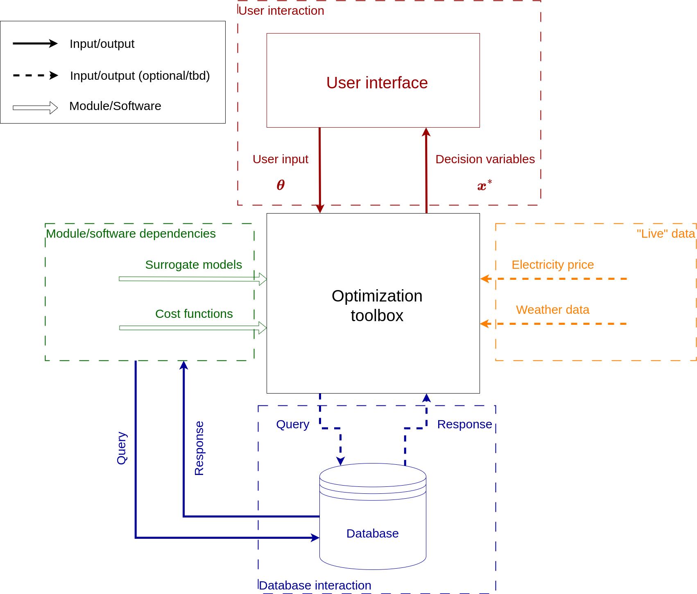

# Software Design Document for Wind-farm Multi-objective control toolbox

## 1. Overview
The Wind-farm Multi-objective control toolbox is a Python-based application that finds optimal solutions for Multi-objective control of wind farms as part of the TWAIN project.

---

## 2. Functional Overview
The software provides the following core functionalities:
1. User interface
    - specify scenarios (User input)
        - GUI
        - Web service
        - CLI
        - API
    - visualize optimization result (decision variables)
        - GUI
        - Web service
    - export optimization result (decision variables)
1. Use existing tools/libraries to compute decision variables
    - surrogate models
    - cost functions
    - electricity price
    - ... 
1. Exploit data maintained within TWAIN project (database)

---

## 3. Architecture

### High-level interaction with TWAIN
#### Diagram

### Layered Design
The system consists of three primary layers:
- **Presentation Layer**: Handles user interaction (GUI, Web application, file export).
- **Application Layer**: Processes data, scenario specifications, optimization.
- **Database Layer**: Manages retrieval of data from TWAIN database(s)

#### Diagram

---

## 4. Detailed Design
### Component 1: User interface (Input)
- **Purpose**: Allows the user to specify scenario parameters
- **Inputs**:
    - User input
- **Outputs**:
    - Scenario parameters
        - Wind-farm specific parameters
        - Multi-objective weights
        - ...
- **Interfaces**:
    - GUI, Web service, CLI or API for user input
    - passes user input to scenario processor
- **Key Functions**:
  - `[Function Name]`: [Description of the function.]
- **Constraints**:

### Component 2: Optimization engine
- **Purpose**: Compute optimal values for decision variables
- **Inputs**:
    - user-defined parameters
    - data from TWAIN database
- **Outputs**:
    - optimized decision variables
- **Interfaces**:
    - receives user-defined parameters
    - requests data from TWAIN data base
    - receives data from TWAIN data base
    - passes optimized parameters to results processor
- **Key Functions**:
    - `Surrogate model`: surrogate model used to compute WT loads, power, ...
    - `Cost function 1`: evaluate first cost function
    - `Cost function 2`: evaluate second cost function
    - ...
    - `Optimizer`: compute optimization
    - ...
- **Constraints**:

### Component 3: [Component name]
...

---

## 5. Data Design
### Database Schema
See other TWAIN WPs

### Scenario parameters
e.g.
- Number of wind turbines
- Size/type of wind turbines
- wind rose
- ...
### Optimization parameters
e.g.
- Wind farm layout
- wind turbine control strategies
---

## 6. Error Handling
- Invalid input: ...
- Optimization failure: ...
- ...

---

## 7. Future Considerations

---

## 8. References

---

## Appendix

