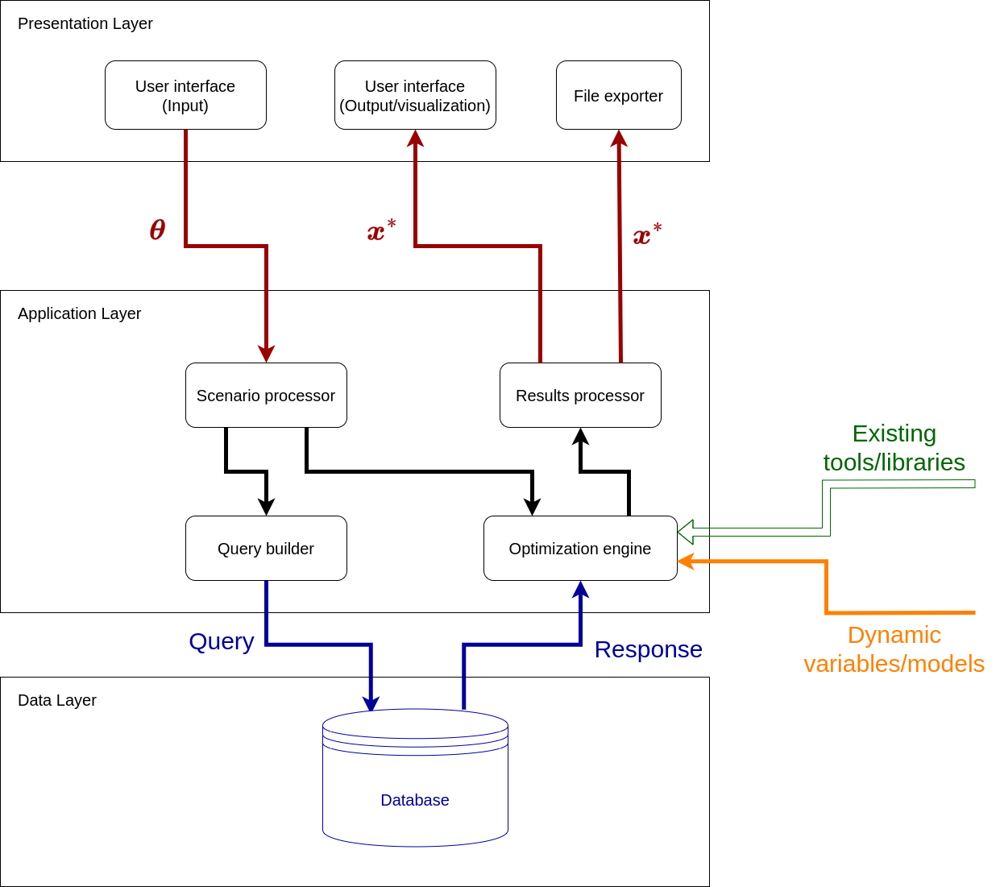

# Software Design Document for Wind-farm Multi-objective control toolbox

## 1. Overview
The Wind-farm Multi-objective control toolbox is a Python-based application that finds optimal solutions for Multi-objective control of wind farms as part of the TWAIN project.

---

## 2. Functional Overview
The software provides the following core functionalities:
1. User interface to specify wind-farm control scenarios
2. Exploit surrogate models, cost functions and SCADA data maintained within the TWAIN project
3. Compute optimal design parameters and control strategies for wind-farm control
4. Visualization and analysis tools for evaluation of optimization results

---

## 3. Architecture
### High-Level Design
The system consists of three primary layers:
- **Presentation Layer**: Handles user interaction (GUI, Web application, file export).
- **Application Layer**: Processes data, scenario specifications, optimization.
- **Database Layer**: Manages retrieval of data from TWAIN database(s)

### Diagram

---

## 4. Detailed Design
### Component 1: User interface
- **Purpose**: Allows the user to specify scenario parameters and to inspect results
- **Inputs**:
    - Wind-farm specific parameters
    - Multi-objective weights
    - ...
- **Outputs**:
- **Interfaces**:
    - passes user input to Scenario processor
    - receives optimization results from results processor
- **Key Functions**:
  - `[Function Name]`: [Description of the function.]
- **Constraints**:

### Component 2: Optimization engine
- **Purpose**: Perform the actual optimization
- **Inputs**:
    - user-defined parameters
    - data from TWAIN database
- **Outputs**:
    - optimized parameters
- **Interfaces**:
    - receives user-defined parameters
    - receives data from TWAIN data base
    - passes optimized parameters to results processor
- **Key Functions**:
  - `Cost function 1`: evaluate first cost function
  - `Cost function 2`: evaluate second cost function
  - ...
  - `Optimizer`: compute optimization
  - ...
- **Constraints**:

### Component 3: [Component name]
...

---

## 5. Data Design
### Database Schema
See other TWAIN WPs

### Scenario parameters
e.g.
- Number of wind turbines
- Size/type of wind turbines
- wind rose
- ...
### Optimization parameters
e.g.
- Wind farm layout
- wind turbine control strategies
---

## 6. Error Handling
- Invalid input: ...
- Optimization failure: ...
- ...

---

## 7. Future Considerations

---

## 8. References

---

## Appendix

